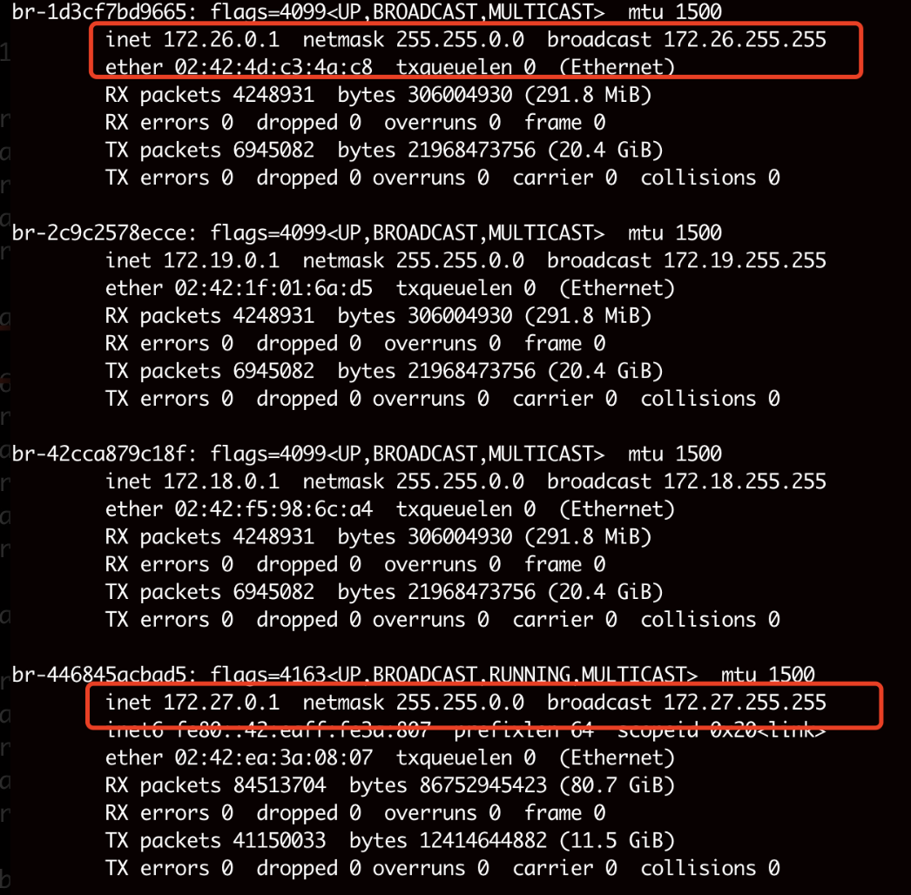

# 容器网络影响宿主机入网问题排查

## 问题描述
发现172.27.0.0/16，172.26.0.0/16 网段的服务无法访问宿主机的服务

## 问题排查


```
docker network ls
NETWORK ID     NAME                      DRIVER    SCOPE
8eacdcbf22d7   7b-full_default           bridge    local
f22af6f77037   bridge                    bridge    local
4a56201be716   host                      host      local
6e36d25cdbb0   llama2-13b-lora_default   bridge    local
fb2839792d18   llama3-8b_lora_default    bridge    local
d1f916892b02   none                      null      local
2c9c2578ecce   tgi_default               bridge    local
446845acbad5   v2-9b_default             bridge    local
d1301d605f3c   v2-27b-it_default         bridge    local
c3d523d51ee4   v3-8b_default             bridge    local
1d3cf7bd9665   v4-9b_default             bridge    local
59aecf59ca81   v31-8b_default            bridge    local
42cca879c18f   webui-docker_default      bridge    local
```
发现1d3cf7bd9665、1d3cf7bd9665占用了172.27.0.0/16，172.26.0.0/16 网段，导致路由冲突。Linux 内核的路由机制会优先选择 最匹配的路由，它会覆盖默认路由，流量会被错误的流向docker。

## 解决方法

### 修改docker 配置，不使用冲突网段
```json
{
  "bip": "192.168.100.1/24",
  "default-address-pools": [
    {
      "base": "192.168.200.0/20",
      "size": 24
    }
  ]
}
```
### 创建容器时使用特定网络
docker network create --subnet=xx.xx.xx.xx/24 my_custom_network

### 如果必须保留冲突网段，修改宿主机路由，让外部网络优先
```shell
ip route del 172.27.0.0/16
ip route add 172.27.0.0/16 via <外部网关> metric 100
```