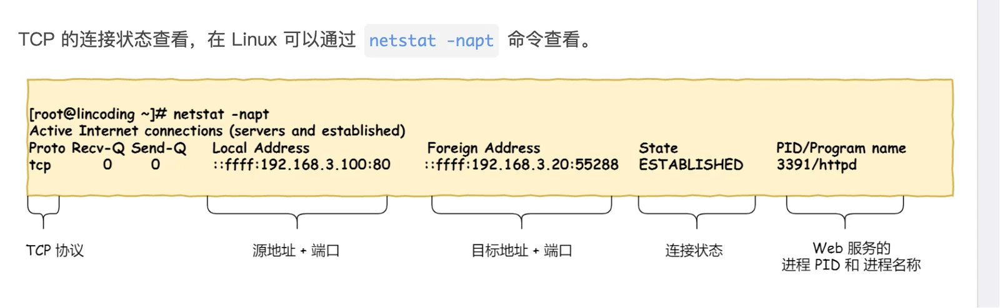
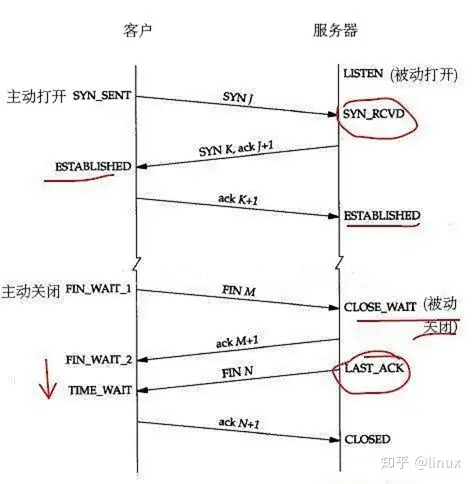

## OSI 七层模型
```mermaid
发送端（电脑A）                          接收端（电脑B）
+----------------+                      +----------------+
| 应用层：Data   |                      | 应用层：Data   |
|  "Hi"          |                      |  "Hi"          |
+-------+--------+                      +-------^--------+
        |                                       |
| 表示层：Data + 表示头                    表示层：Data（剥离表示头）
+-------+--------+                      +-------^--------+
        |                                       |
| 会话层：Data + 会话头                    会话层：Data（剥离会话头）
+-------+--------+                      +-------^--------+
        |                                       |
| 传输层：Segment（Data + 端口头）        传输层：Data（剥离端口头）
+-------+--------+                      +-------^--------+
        |                                       |
| 网络层：Packet（Segment + IP头）       网络层：Segment（剥离IP头）
+-------+--------+                      +-------^--------+
        |                                       |
| 数据链路层：Frame（Packet + MAC头 + CRC）数据链路层：Packet（剥离MAC头+CRC）
+-------+--------+                      +-------^--------+
        |                                       |
| 物理层：Bits（Frame转换）               物理层：Frame（Bits转换）
+-------+--------+                      +-------^--------+
        |                                       |
        +---------------------------------------+
               物理介质（网线/无线）
```

| OSI 层 | 核心功能 | 关键设备 / 组件 |
| ------ | -------- | --------------- |
| 应用层 | 提供应用程序之间的通信 | 浏览器、FTP客户端、SMTP客户端 |
| 表示层 | 数据的表示和转换 | 加密、压缩 |
| 会话层 | 管理会话连接 | 会话ID |
| 传输层 | 端到端通信 | TCP、UDP |
| 网络层 | 跨网络路由与 IP 地址识别 | 路由器、三层交换机 |
| 数据链路层 | 帧传输与 MAC 地址识别 | 网卡、交换机 |
| 物理层 | 比特流传输 | 网线、光纤 |


## HTTP/1.1 和 HTTP/2 的区别

| 特性           | HTTP/1.1                                     | HTTP/2                                        |
|----------------|---------------------------------------------|-----------------------------------------------|
| 传输开销       | 文本传输，开销较大                           | 二进制流传输，开销更小                        |
| 多路复用       | HTTP/1.1 管线化实践有限，通常需要多个连接并行请求 | 单个 TCP 连接上可以同时承载多个数据流，减少队头阻塞 |
| 服务器推送     | 不支持                                       | 协议支持，但主流浏览器中的实际使用已比较有限     |
| 标头压缩       | 不压缩或简单压缩，冗余信息多                 | 使用 HPACK 压缩，减少冗余，提高加载速度        |

## TCP 协议

### TCP 的连接状态

`ESTABLISHED` 的字面含义是“已建立、已确立”。在 TCP 状态机中，它表示三次握手已经完成，双方可以正常收发数据，并不表示连接已经建立了很长时间或已经投入使用很久。



下面这张图补充了 TCP 从建立连接到关闭连接的主要状态变化：



- **建立连接**：客户端从 `SYN_SENT` 开始，服务器从 `LISTEN` 进入 `SYN_RCVD`；第三次握手完成后，双方都进入 `ESTABLISHED`。
- **主动关闭的一方**：通常依次经历 `FIN_WAIT_1`、`FIN_WAIT_2`、`TIME_WAIT`，最后进入 `CLOSED`。
- **被动关闭的一方**：收到 FIN 后进入 `CLOSE_WAIT`，应用关闭连接后发送 FIN，再进入 `LAST_ACK`，收到 ACK 后进入 `CLOSED`。
- **`TIME_WAIT`**：主动关闭方为确保最后的 ACK 能够重传，并让旧报文在网络中自然过期而暂时保留连接状态，通常持续约两个最大报文段寿命（2MSL）。

### 客户端出现大量 `TIME_WAIT` 的原因

1. **短连接过多**
   - HTTP Keep-Alive 未开启
   - 使用 HTTP/1.0 或 `Connection: close`
   - 数据库、Redis、RPC 连接池没有复用
   - 连接池配置过小或配置错误
2. **请求量或连接创建速率很高**，例如高 QPS 场景。
3. **超时、重试或熔断配置不合理**，导致连接反复建立和关闭。
4. **负载均衡代理配置不合理**，例如负载均衡器、Nginx 或网关的 `idle timeout` 不匹配，导致连接频繁断开和重建。

### 为什么 TCP 是三次握手

TCP 三次握手的目的，是在正式传输数据之前，让通信双方确认彼此具备收发能力，并协商连接参数（如初始序列号），建立可靠连接。

```yaml
Client                      Server

SYN(seq=100)
---------------------------->

             SYN(seq=500)
             ACK=101
<----------------------------

ACK=501
---------------------------->

Connection Established
```

第一次握手，客户端发送 SYN 报文，请求建立连接，并携带自己的初始序列号。

第二次握手，服务器收到后返回 SYN+ACK，一方面确认客户端的 SYN，另一方面发送自己的初始序列号。

第三次握手，客户端发送 ACK，确认服务器的 SYN。至此，双方进入 `ESTABLISHED` 状态，可以开始可靠的数据传输。

#### 为什么不是 2 次握手

两次握手只能让服务器确认收到了客户端的 SYN，不能让客户端确认服务器已经收到自己的报文，也不能让服务器确认客户端已经收到了自己的 SYN+ACK。若网络中存在延迟到达的旧 SYN，服务器还可能为一个实际上已经失效的请求分配连接资源，形成半连接或错误连接。

#### 为什么不是 4 次或更多？
3 次已经足以建立连接，4 次或更多次握手会增加复杂性和资源浪费

### TCP 的核心特点

- 面向连接
- 保证数据可靠到达
- 具有重传机制
- 保证数据有序
- 具有流量控制
- 具有拥塞控制

### UDP 的核心特点

- 无连接
- 不保证送达
- 通常不负责重传
- 延迟较低、开销较小

### 什么是滑动窗口？

发送方不需要每发送一个数据段就等待 ACK，而是可以在窗口允许的范围内连续发送多个数据段。接收方通过 ACK 和接收窗口（`rwnd`）通知发送方哪些数据已经收到、还能接收多少数据，发送窗口会随着 ACK 的到来不断向前滑动，因此称为滑动窗口。

实际可发送的数据量还会受到拥塞窗口（`cwnd`）的限制，因此有效发送窗口通常取 `min(rwnd, cwnd)`。


## DNS 解析流程

```shell
客户端访问域名
例如：www.example.com
        │
        ▼
1. 查询浏览器 DNS 缓存
        │
        ├─ 命中
        │    └─ 返回 IP 地址
        │
        └─ 未命中
             │
             ▼
2. 查询操作系统 DNS 缓存
        │
        ├─ 命中
        │    └─ 返回 IP 地址
        │
        └─ 未命中
             │
             ▼
3. 查询 hosts 文件
   Linux：/etc/hosts
   Windows：hosts 文件
        │
        ├─ 命中
        │    └─ 返回 IP 地址
        │
        └─ 未命中
             │
             ▼
4. 向配置的 DNS Resolver 发起查询
   /etc/resolv.conf 中的 nameserver
   例如本地路由器、运营商 DNS、公共 DNS
             │
             ▼
5. DNS Resolver 查询自身缓存
             │
             ├─ 命中
             │    └─ 根据 TTL 返回 IP 地址
             │
             └─ 未命中
                  │
                  ▼
6. DNS 迭代查询
                  │
                  ▼
             根 DNS 服务器
                  │
                  ▼
             顶级域 DNS 服务器
             例如：.com、.cn
                  │
                  ▼
             权威 DNS 服务器
             例如：Route 53
                  │
                  ▼
             获得域名对应的 IP 地址
                  │
                  ▼
7. Resolver 将结果返回客户端
   同时根据 TTL 进行缓存
                  │
                  ▼
8. 客户端拿到 IP 地址
                  │
                  ▼
9. 发起 TCP 三次握手
                  │
                  ▼
10. 建立连接并开始传输数据
```
Route 53 可能位于流程中的两环：

在公网域名解析流程中，Route 53 通常位于：权威 DNS 服务器（迭代查询）

Route 53 VPC Resolver：递归 DNS Resolver（/etc/resolv.conf）
## Cookie、Session、Token

三者都是状态管理或身份认证中常见的机制，区别可以从以下几个方面理解：

| 机制 | 主要存储位置 | 请求中如何携带 | 典型特点 |
| --- | --- | --- | --- |
| Cookie | 客户端浏览器 | 浏览器按域名和路径自动携带 | 适合浏览器会话；可设置 `HttpOnly`、`Secure`、`SameSite` |
| Session | 服务端，客户端通常只保存 Session ID | Session ID 通常放在 Cookie 中 | 服务端保存状态，便于主动失效，但需要处理共享存储或会话粘滞 |
| Token | 通常由客户端保存，服务端负责校验 | 常放在 `Authorization` 请求头中 | 适合 API、移动端和服务间认证；可设计为无状态或配合服务端存储 |

- Cookie、Session、Token 的安全性都取决于具体实现，Token 并不天然加密。JWT 默认是编码和签名，不能把其中的内容当作机密数据；需要保密时应使用加密或避免放入敏感信息。
- Cookie 不是“天然不安全”：认证 Cookie 通常应设置 `HttpOnly`、`Secure` 和合适的 `SameSite`，同时防范 CSRF 和 XSS。
- Token 也不是天然支持跨域。跨域请求仍受 CORS、Cookie 的 `SameSite`/`Domain`、请求头配置等规则约束；使用 `localStorage` 保存 Token 时，还要重点防范 XSS。
- Cookie 常用于登录状态、用户偏好和会话保持；Session 适合购物车、表单流程等服务端状态较多的场景；Token 常用于 API 访问控制、SSO 和移动应用认证。

## HTTP 状态码和原因

一些高频考察的状态码：

- `200 OK`：请求成功。
- `201 Created`：资源创建成功，常见于 `POST` 请求。
- `301 Moved Permanently`：资源已永久移动，常用于域名或 URL 迁移。
- `302 Found`：临时重定向，常用于登录跳转；具体语义还要结合请求方法和客户端行为判断。
- `400 Bad Request`：请求格式、参数或协议不符合要求。
- `401 Unauthorized`：未认证或认证信息无效；不是“没有权限”的唯一表示。
- `403 Forbidden`：服务器理解请求，但拒绝执行，例如 Token 有效但权限不足。
- `404 Not Found`：请求的资源不存在，或服务端不希望暴露其是否存在。
- `429 Too Many Requests`：请求频率超过限制。
- `500 Internal Server Error`：服务端发生未被更具体状态码描述的异常。
- `502 Bad Gateway`：网关或反向代理从上游服务收到无效响应，或无法正确解析上游响应。
- `503 Service Unavailable`：服务暂时不可用，可能处于过载、维护或没有可用实例的状态。
- `504 Gateway Timeout`：网关等待上游响应超时。

🔥502、503、504的区别
```shell
客户端
   ↓
网关 / Nginx / Load Balancer
   ↓
上游服务

```

```
客户端请求
   │
   ▼
网关连接上游
   │
   ├─ 上游连接失败或返回非法响应
   │    └─ 502
   │
   ├─ 没有健康的上游实例
   │    └─ 503
   │
   ├─ 上游处理很慢，超过网关超时时间
   │    └─ 504
   │
   └─ 正常返回
        └─ 返回上游实际响应
```

|状态码|	含义|	典型场景|
| --- | --- | --- |
| 502 Bad Gateway	|网关从上游收到无效响应	|上游进程崩溃、连接被重置、响应格式错误、协议或 TLS 握手异常|
| 503 Service Unavailable	|当前没有可用服务处理请求	|服务过载、正在发布、实例全部不健康、线程池/连接池耗尽、限流或熔断|
| 504 Gateway Timeout	|网关等待上游响应超时	|上游处理太慢、数据库查询慢、网络延迟、网关超时时间过短|


## Linux 网络丢包排查

排查链路：

```text
应用 → 系统调用 → Linux 网络栈 → 网卡队列 → 云网络 → 外部链路 → 对端
```

### 从应用和连接现象开始

- 查看应用日志，确认是连接超时、连接被拒绝、读超时，还是接口 QPS 突增。
- 使用 `curl`、`wget` 或业务客户端复现，区分 DNS、TCP、TLS 和 HTTP 哪一层失败。
- 用 `ss` 查看连接状态，用 `tcpdump` 验证报文是否发出、是否收到响应：

```shell
ss -s
ss -antp
sudo tcpdump -i eth0 host <peer-ip> -w app.pcap
```

### 检查网卡、内核网络栈和 CPU

```shell
ip -s link show dev eth0
ethtool -S eth0
ethtool -g eth0
netstat -s
nstat -az
```

常见指标含义：

| 指标 | 含义 | 常见原因 |
| --- | --- | --- |
| `rx_dropped` | 接收丢包 | 网卡或内核接收队列满、策略丢弃 |
| `rx_errors` | 接收错误 | CRC、帧格式或驱动错误 |
| `tx_errors` | 发送错误 | 网卡、驱动或链路异常 |
| `rx_no_buffer` | 接收缓冲不足 | 突发流量或处理不及时 |
| `rx_over_errors` | 接收队列溢出 | CPU、软中断或队列处理能力不足 |

检查内核队列和 TCP 缓冲区：

```shell
sysctl net.core.netdev_max_backlog
sysctl net.core.rmem_default
sysctl net.core.wmem_default
sysctl net.ipv4.tcp_rmem
sysctl net.ipv4.tcp_wmem
```

如果丢包伴随 CPU 较高，还要观察软中断和网卡多队列配置：

```shell
mpstat -P ALL 1
cat /proc/interrupts
ethtool -l eth0
ethtool -k eth0
```

### 检查路由、防火墙和网络路径

```shell
ip addr
ip route get <target-ip>
ip neigh
ping -c 4 <target-ip>
mtr -rwzbc 100 <target-ip>
traceroute <target-ip>
```

注意：`ping` 或 `mtr` 丢包不一定代表业务 TCP 丢包，部分设备会限制 ICMP 或降低 ICMP 优先级，最终仍应结合业务端口和抓包判断。

检查端口监听、防火墙和连接跟踪：

```shell
ss -lntp
sudo nft list ruleset
sudo iptables -L -n -v
sudo conntrack -S
```

### 用抓包定位丢包位置

```shell
# 本机抓取指定主机和端口的报文
sudo tcpdump -i eth0 -nn host <peer-ip> and port 443 -w local.pcap

# 只看 TCP 握手、重传和连接关闭相关信息
sudo tcpdump -i eth0 -nn 'tcp[tcpflags] & (tcp-syn|tcp-fin|tcp-rst) != 0'
```

通过比较客户端、代理和对端的抓包，可以判断是“本机没有发出”“对端没有收到”“对端已回复但中间丢失”，还是“应用收到报文但处理超时”。云环境中还要结合云厂商的网卡、负载均衡器和安全组指标。

### 其他常用工具

- `sar -n DEV 1`：查看网卡吞吐和错误统计。
- `sar -n TCP,ETCP 1`：观察 TCP 建连、重传和失败情况。
- `iperf3`：在两台受控主机之间验证带宽、延迟和吞吐能力。
- `ethtool`：查看网卡协商、Ring Buffer、Offload 和硬件统计。

## 常见网络排查命令

上面的内容是按丢包链路排查，下面按命令类别整理一份面试和实际排障时常用的速查表。

### 网卡、IP、路由

| 命令 | 作用 | 重点关注 | 常见问题 |
| --- | --- | --- | --- |
| `ip addr` | 查看网卡和 IP | IP、子网、网卡状态 | IP 配置错误、网卡未启用 |
| `ip link` | 查看网卡链路状态 | `UP`、`DOWN` | 网卡或链路故障 |
| `ip route` | 查看路由表 | 默认路由、目标网段 | 路由缺失、网关错误 |
| `ip route get 8.8.8.8` | 查看访问目标 IP 的实际路径 | 出口网卡、网关、源 IP | 流量走错出口 |
| `ip neigh` | 查看 ARP 邻居 | `REACHABLE`、`FAILED` | ARP 异常、网关不可达 |
| `ip -s link` | 查看网卡收发包统计 | `errors`、`dropped`、`overruns` | 网卡丢包、驱动异常 |

### DNS 解析

| 命令 | 作用 | 重点关注 | 常见问题 |
| --- | --- | --- | --- |
| `dig example.com` | 查询域名解析 | A、AAAA、CNAME、TTL | 解析记录错误 |
| `dig @8.8.8.8 example.com` | 指定 DNS 查询 | 不同 DNS 返回结果 | DNS 污染或 DNS 不一致 |
| `dig +trace example.com` | 查看完整迭代过程 | 根 DNS、顶级域、权威 DNS | 委派链路异常 |
| `getent hosts example.com` | 按系统实际流程解析 | hosts、NSS、系统 DNS | 程序和 `dig` 结果不一致 |
| `cat /etc/resolv.conf` | 查看 DNS 配置 | `nameserver` | DNS Server 配置错误 |
| `cat /etc/hosts` | 查看本地映射 | 是否存在错误记录 | hosts 覆盖了正确解析 |

### 网络连通性和路径

| 命令 | 作用 | 重点关注 | 常见问题 |
| --- | --- | --- | --- |
| `ping -c 4 8.8.8.8` | 测试 IP 连通性 | 延迟、丢包 | 网络不通、链路丢包 |
| `traceroute 8.8.8.8` | 查看网络路径 | 从哪一跳开始异常 | 路由或中间设备问题 |
| `tracepath 8.8.8.8` | 查看路径和 MTU | MTU、路径变化 | MTU 不匹配 |
| `mtr -rw 8.8.8.8` | 持续测试路径质量 | 丢包、延迟 | 链路抖动、网络拥塞 |
| `nc -vz 10.0.0.10 8080` | 测试 TCP 端口 | 是否能建立连接 | 防火墙、端口未监听 |

`ping` 不通不一定代表服务不可用，因为 ICMP 可能被防火墙禁止；排查业务时还要使用目标端口进行验证。

### 端口和 TCP 连接

| 命令 | 作用 | 重点关注 | 常见问题 |
| --- | --- | --- | --- |
| `ss -lntup` | 查看监听端口和进程 | 监听地址、端口、PID | 服务未监听、只监听 `127.0.0.1` |
| `ss -antp` | 查看所有 TCP 连接 | TCP 状态、对端地址 | 连接堆积、连接泄漏 |
| `ss -s` | 查看连接汇总 | `ESTABLISHED`、`TIME-WAIT`、`CLOSE-WAIT` | 连接数量异常 |
| `ss -ant state time-wait` | 查看 TIME_WAIT | 数量、对端分布 | 短连接过多、临时端口耗尽 |
| `ss -ant state close-wait` | 查看 CLOSE_WAIT | 数量是否持续增长 | 应用没有及时 close |
| `lsof -i :8080` | 查看端口占用进程 | PID、进程名 | 端口被错误进程占用 |
| `fuser -n tcp 8080` | 查看端口对应进程 | PID | 快速定位端口进程 |

### HTTP、HTTPS 和应用层

| 命令 | 作用 | 重点关注 | 常见问题 |
| --- | --- | --- | --- |
| `curl -v http://example.com` | 查看 HTTP 访问过程 | 请求头、响应头、状态码 | 502、503、504、重定向 |
| `curl -I https://example.com` | 只查看响应头 | HTTP 状态、`Location`、`Server` | 网关、重定向、服务状态 |
| `curl -k -v https://example.com` | 排查 HTTPS/TLS | 证书、TLS 握手、协议版本 | 证书错误、TLS 握手失败 |
| `curl -o /dev/null -sS -w '时间统计' https://example.com` | 查看分阶段耗时 | DNS、TCP、TLS、TTFB、总耗时 | 定位请求慢在哪个阶段 |

其中，`curl -w` 可以输出 `%{time_namelookup}`、`%{time_connect}`、`%{time_appconnect}`、`%{time_starttransfer}` 和 `%{time_total}` 等字段，用来拆分请求耗时。

### tcpdump 抓包

| 命令 | 用途 | 重点观察 |
| --- | --- | --- |
| `tcpdump -nn -i any host 10.0.0.10` | 抓取指定 IP 流量 | 是否有请求和响应 |
| `tcpdump -nn -i eth0 port 8080` | 抓取指定端口流量 | TCP 建连、数据传输 |
| `tcpdump -nn -i any 'tcp[tcpflags] & tcp-syn != 0'` | 查看 SYN | 是否发出 SYN、是否收到 SYN-ACK |
| `tcpdump -nn -i any 'tcp[tcpflags] & tcp-rst != 0'` | 查看 RST | 谁重置了连接 |
| `tcpdump -nn -i any 'tcp[tcpflags] & tcp-fin != 0'` | 查看 FIN | 谁主动关闭连接 |
| `tcpdump -nn -i any -c 100 -s 0 -w /tmp/test.pcap port 8080` | 抓取并保存报文 | 后续使用 Wireshark 分析 |
| `tcpdump -nn -r /tmp/test.pcap` | 读取抓包文件 | 离线分析报文 |

### tcpdump 参数含义

| 参数 | 含义 |
| --- | --- |
| `-i eth0` | 指定抓包网卡 |
| `-i any` | 抓取所有网卡，Linux 常用 |
| `-n` | 不把 IP 解析成域名 |
| `-nn` | 不解析 IP，也不把端口解析成服务名 |
| `-c 100` | 抓取 100 个报文后退出 |
| `-s 0` | 抓取完整报文，避免内容被截断 |
| `-v`、`-vv`、`-vvv` | 显示更多详细信息 |
| `-A` | 以 ASCII 显示报文内容 |
| `-X` | 同时显示十六进制和 ASCII |
| `-w file.pcap` | 保存为抓包文件 |
| `-r file.pcap` | 读取抓包文件 |
| `-tttt` | 显示完整可读时间 |
| `-e` | 显示 MAC 地址等二层信息 |

### tcpdump 过滤条件

| 条件 | 含义 |
| --- | --- |
| `host 10.0.0.10` | 来源或目标是指定 IP |
| `src host 10.0.0.10` | 来源 IP 是指定 IP |
| `dst host 10.0.0.10` | 目标 IP 是指定 IP |
| `port 8080` | 来源或目标端口是 8080 |
| `src port 8080` | 来源端口是 8080 |
| `dst port 8080` | 目标端口是 8080 |
| `tcp` | 只抓 TCP |
| `udp` | 只抓 UDP |
| `icmp` | 只抓 ICMP |
| `and` | 并且 |
| `or` | 或者 |
| `not` | 排除 |

### 网络性能和协议统计

| 命令 | 作用 | 重点关注 | 常见问题 |
| --- | --- | --- | --- |
| `sar -n DEV 1` | 查看网卡流量 | 收发速率、错误、丢包 | 带宽打满、网卡异常 |
| `sar -n TCP,ETCP 1` | 查看 TCP 统计 | 建连、关闭、重传 | TCP 重传、连接失败 |
| `nstat` | 查看协议栈统计 | Retrans、RST、失败 | 内核协议栈异常 |
| `ethtool -S eth0` | 查看网卡底层统计 | CRC、队列、丢包 | 网卡驱动或硬件问题 |
| `iperf3 -s` / `iperf3 -c <IP>` | 测试两台机器吞吐 | 带宽、重传 | 链路带宽不足 |

### 防火墙、连接跟踪和内核参数

| 命令 | 作用 | 重点关注 | 常见问题 |
| --- | --- | --- | --- |
| `nft list ruleset` | 查看 nftables 规则 | DROP、REJECT | 防火墙拦截 |
| `iptables -L -n -v` | 查看 iptables 规则和命中数 | DROP、REJECT、计数 | 规则误拦截 |
| `conntrack -S` | 查看连接跟踪状态 | 是否接近容量上限 | NAT 表满 |
| `sysctl net.ipv4.ip_local_port_range` | 查看临时端口范围 | 端口数量 | 临时端口耗尽 |
| `sysctl -a \| grep tcp` | 查看 TCP 内核参数 | backlog、重传、端口复用 | 内核参数配置不合理 |

## 长连接、短连接、WebSocket 的区别和使用场景

### 短连接

客户端与服务器之间的连接在一次请求完成后关闭。HTTP/1.0 默认倾向于短连接；HTTP/1.1 通常使用 Keep-Alive，因此不能简单把“HTTP 请求”都等同于短连接。

- 适合交互频率低、请求完成后不需要保持连接的场景。
- 连接建立和关闭成本较高，高并发场景通常会配合连接池或连接复用。

### 长连接

一次 TCP 连接中可以进行多次请求和响应，减少频繁建立连接的开销。HTTP/1.1 默认支持持久连接，MySQL、Redis 等客户端也通常通过连接池复用连接。

- 适合频繁请求、连接建立成本较高或需要保持会话的场景。
- 需要合理设置空闲超时、最大连接数和心跳，否则可能积累大量空闲连接。

### WebSocket

WebSocket 通常先通过 HTTP Upgrade 建立连接，随后在同一条 TCP 连接上进行全双工通信，服务器可以主动向客户端推送数据。

- 适合在线协作、即时消息、实时行情、在线游戏和部分 IoT 场景。
- 如果只是客户端周期性拉取数据，短轮询或 SSE 可能更简单；选型要结合通信方向、连接规模和代理兼容性。

## MAC 地址和 IP 地址如何转换

在 IPv4 局域网中，ARP 用于根据目标 IP 查询下一跳的 MAC 地址，并通过 ARP 缓存保存映射关系。IPv6 不使用 ARP，而是使用邻居发现协议（NDP）。

以同一局域网内通信为例：

1. 源主机查看 ARP 缓存；没有记录时，广播 ARP Request，携带源 IP、源 MAC 和待查询的目标 IP。
2. 目标主机发现请求中的目标 IP 是自己后，单播返回 ARP Reply，携带自己的 IP 和 MAC；两端也会根据报文更新缓存。
3. 源主机拿到目标 MAC 后，把 IP 数据包封装成以太网帧发送。

如果目标 IP 不在本地网段，源主机查询的不是目标主机 MAC，而是默认网关的 MAC，然后由路由器逐跳转发。

## LVS、Nginx、HAProxy 的区别和使用场景

- **LVS**：主要工作在四层，通过 IP、端口等信息转发 TCP/UDP 流量，性能和吞吐能力强，常用于大规模集群的基础负载均衡。
- **Nginx**：主要工作在七层，擅长 HTTP/HTTPS 反向代理、静态资源、TLS 终止、基于域名或 URL 的路由；`stream` 模块也可以代理部分 TCP/UDP 流量。
- **HAProxy**：同时支持四层和七层代理，健康检查、连接管理和负载均衡能力较强，常用于高性能 TCP 或 HTTP 代理场景。

实际架构中经常组合使用，例如 LVS 做四层流量分发，Nginx 或 HAProxy 在后端做七层路由和业务治理。

## 常见的负载均衡算法

- **轮询（Round Robin）**：按顺序将请求分配给后端实例，适合实例配置相近的场景。
- **加权轮询（Weighted Round Robin）**：按权重分配流量，适合实例规格不同或需要灰度的场景。
- **最少连接（Least Connections）**：优先转发到当前连接数较少的实例，适合请求耗时差异较大的场景。
- **加权最少连接**：同时考虑实例权重和连接数。
- **随机（Random）**：随机选择一个后端实例处理请求。
- **加权随机（Weighted Random）**：按照后端权重比例随机选择实例。
- **IP Hash / 一致性哈希**：让同一客户端或同一 Key 尽量落到同一实例，适合需要会话粘滞的场景，但要注意实例扩缩容和热点问题。
- **随机或最短响应时间**：根据随机结果或历史延迟选择后端，具体效果依赖实现和监控数据。

## ALB 和 NLB 的区别

以下以云厂商常见的命名方式为例，不同厂商的具体能力和限制可能不同：

| 项目 | ALB | NLB |
| --- | --- | --- |
| 工作层级 | 七层，通常处理 HTTP/HTTPS | 四层，通常处理 TCP/UDP，也可能支持 TLS |
| 路由依据 | 域名、URL、请求头、Cookie 等 | IP、端口和连接 |
| 典型能力 | URL 路由、TLS 终止、重写、WAF 集成 | 高吞吐、低延迟、长连接和静态 IP 等 |
| 适用场景 | Web、API、微服务网关 | 数据库代理、TCP 服务、实时通信和高并发连接 |

## CDN 常见面试题

### CDN 如何实现就近访问？

用户访问加速域名时，通常先通过 DNS 或 GSLB 将请求调度到合适的 CDN 节点。调度时会综合地域、运营商、节点健康状态、负载和网络质量等信息。节点命中缓存时直接返回，未命中时向源站回源并缓存响应。

### 为什么域名要使用 CNAME？

业务域名通过 CNAME 指向 CDN 厂商提供的调度域名，厂商就可以根据实时节点状态和网络情况返回合适的节点 IP。直接配置固定 IP 会失去动态调度和故障切换能力。

### 什么情况下 CDN 会回源？

- 缓存未命中（Cache MISS）。
- 缓存已过期，或通过 `ETag` / `Last-Modified` 校验后需要重新获取内容。
- 源站通过 `Cache-Control` 指定不缓存，或请求携带了会绕过缓存的条件。
- 动态请求、个性化请求，或 CDN 配置为不缓存的资源。

### CDN 缓存由哪些 HTTP 头控制？

- `Cache-Control: max-age=3600`：指定浏览器缓存 3600 秒。
- `Cache-Control: s-maxage=3600`：指定共享缓存（如 CDN）缓存 3600 秒，可以让浏览器较快更新，同时避免 CDN 频繁回源。
- `no-cache`：可以缓存，但使用前必须向源站重新验证。
- `no-store`：不应存储响应内容。
- `ETag`、`Last-Modified`：用于条件请求和协商缓存，减少重复传输。

### Purge 和 Preload 有什么区别？

- **Purge（刷新/清除缓存）**：删除 CDN 节点上的旧缓存，使后续请求重新回源。
- **Preload（预热）**：提前把资源从源站拉取到 CDN 节点，降低首次访问的回源延迟。

### 如何处理缓存击穿、缓存雪崩和热点 Key？

- 为不同资源设置合理且带随机抖动的 TTL，避免大量缓存同时过期。
- 对热点资源使用多级缓存、源站保护或请求合并，避免大量请求同时回源：

```text
User
 ↓
L1 Edge
 ↓
L2 Regional Cache
 ↓
Origin Shield
 ↓
Origin
```

- **Origin Shield**：CDN 和源站之间的一层集中缓存或回源保护层，减少多个边缘节点同时访问源站。
- **请求合并**：将大量相同资源请求合并为一个回源请求，其他请求共享结果。
- **Singleflight**：针对相同 Key，只允许一个请求真正执行，其他请求等待并共享结果。
- 对必须实时更新的内容采用版本化 URL、精确刷新和灰度发布，减少大范围清缓存。
- 对源站增加限流、熔断和降级，防止 CDN 回源流量压垮应用。
